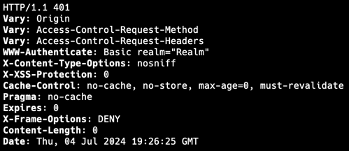
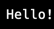
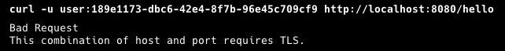
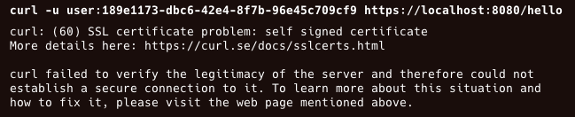
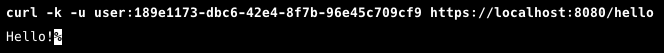
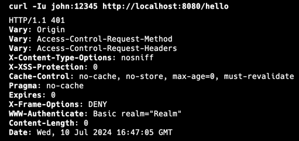
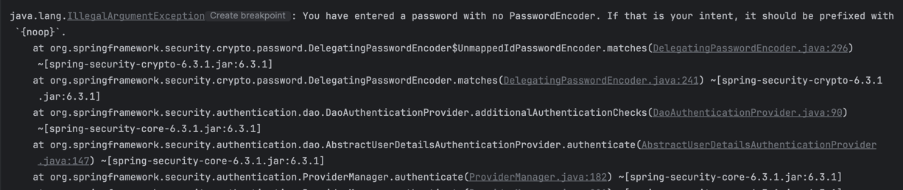

# ss-01

## First curl
```
curl -I http://localhost:8080/hello
```



## with the proper credentials

```curl -u user:f733f743-94f3-4096-96d6-258dcd18a305 http://localhost:8080/hello```



## https







# Ch02 - ex02

```curl -Iu john:12345 http://localhost:8080/hello```



